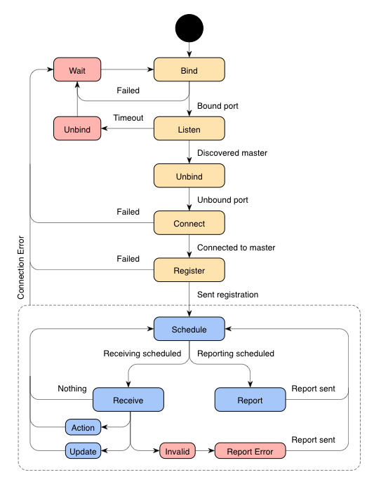

# Actuator Specification

An actuator is a process capable of performing real-world interaction. This
document outlines the states, communications and messages an actuator is
expected to conform to in order to be part of a responsive rooms system.

## Actuator States



### Registration States (Yellow)

| State    | Description                                                       |
|:---------|:------------------------------------------------------------------|
| Bind     | Binds UDP port to use when listening for master broadcasts.       |
| Listen   | Listens for master discovery broadcasts (message M).              |
| Unbind   | Removes UDP port binding.                                         |
| Connect  | Connects to discovered master using TCP.                          |
| Register | Sends registration message to master (message AMR).               |

### Runtime States (Blue)

| State    | Description                                                       |
|:---------|:------------------------------------------------------------------|
| Schedule | Determines when to receive message and report state.              |
| Receive  | Attempts to receive (non-blocking) message from master.           |
| Action   | Carries out received action (in message A).                       |
| Update   | Updates local context data (using message ACU).                   |
| Report   | Sends curent state to master (message AR).                        |

### Error States (Red)

| State    | Description                                                       |
|:---------|:------------------------------------------------------------------|
| Unbind   | Removes UDP port binding.                                         |
| Wait     | Waits for some suitable time.                                     |

## Actuator/Master Communication

An actuator may be connected to one, and only one, master process, which may
change and query its state.

### Registration

```
+------------+    +------------+
|  Actuator  |    |   Master   |
+------------+    +------------+
      |                 |
    +-+-+             +-+-+
    |   |<-----M------|   | [M] Master Process Discovery (Broadcast UDP)
    |   |             |   |
    |   |-----SYN---->|   |
    |   |<--SYN/ACK---|   | TCP Handshake.
    |   |-----ACK---->|   |
    |   |             |   |
    |   |-----AMR---->|   | [AMR] Actuator Master Registration (TCP)*
    +-+-+             +-+-+
      |                 |
      |                 |
```

\* If a sensor has any facility, room or location data, it will send it to
   master in order to help the master in determining its locality.

### Runtime

```
+------------+    +------------+
|  Actuator  |    |   Master   |
+------------+    +------------+
      |                 |
    +-+-+             +-+-+
    |   |<-----CU-----|   | Context Update*
    |   |             |   |
    |   |<-----SU-----|   | State Update
    |   |             |   |
    |   |------AR---->|   | Actuator Report**
    +-+-+             +-+-+
      |                 |
      |                 |
```

\* The message is only sent if necessary, and typically only once.

\** Actuators report at sensible intervals to its master, but at least once
every 29 seconds. An actuator failing to report for 30 seconds will be
considered `unresponsive` for another 30 seconds, after which it is forcibly
deregistered from the master. An `unresponsive` actuator succeeding to send a
report to its master before being deregistered regains normal status.

### De-registration

De-registration occurs by either party terminating the TCP session.

```
+------------+    +------------+
|  Actuator  |    |   Master   |
+------------+    +------------+
      |                 |
    +-+-+             +-+-+
    |   |<----FIN-----|   |
    |   |---FIN/ACK-->|   | TCP Finalization Handshake.
    |   |<----ACK-----|   |
    +-+-+             +-+-+
      |                 |
      X                 X
```

## Actuator/Master Message Protocol

The below list contains all messages relevant to the actuator.

| Msg.| Prt.| Port  | Description                                              |
|:---:|:---:|:-----:|:---------------------------------------------------------|
|  M  | UDP | 14000 | _Broadcast._ Master node identifier.                     |
| AMR | TCP | 14001 | Actuator type, allowed actions with parameter names.     |
|  CU | TCP | 14001 | Facility and room identifiers.                           |
|  SU | TCP | 14001 | Target property and state.                               |
|  AR | TCP | 14001 | Current actuator state.                                  |

### Message Schemata

All messages strictly conform to the [JSON](http://www.json.org) specification.
The root structure is always an object.

#### [M] Master Process Discovery
```
Schema:
  { "message": "M" }         # Message type identifier. Is always "M".
```
```
Example:
  { "message": "M" }
```

#### [AMR] Actuator Master Registration
```
Schema:
  {
    "message": "AMR",        # Message type identifier. Is always "AMR".
    "type": "<type>",        # Type of actuator, eg. "door", "alarm", etc.
    "properties": {
      "<name>": "<type>",    # Name and property type*.
      ...                    # May contain any amount of properties.
    },
    "context": {<context>}   # Data of CU message previously received, or null.
  }
```

\* A property type may be one of "boolean", "integer", "number", "string",
   "array" or "object".

```
Example:
  {
    "message": "AMR",
    "type": "door",
    "properties": {
      "open": "boolean"
    },
    "context": null
  }
```

#### [CU] Context Update
```
Schema:
  {
    "message": "CU",         # Message type identifier. Is always "CU".
    "facility": "<name>",    # Facility identifier.
    "room": "<name>"         # Room identifier.
    "location": {            # Optional. Absolute coordinates.
      "x": <x>,
      "y": <y>,
      "z": <z>
    }
  }
```

```
Example:
  {
    "message": "CU",
    "facility": "A",
    "room": "1202",
    "location": {
      "x": 4.5,
      "y": 1.9,
      "z": 6.2
    }
  }
```

#### [SU] State Update
```
Schema:
  {
    "message": "SU",         # Message type identifier. Is always "SU".
    "properties": {
      "<name>": <value>,     # Name and property value of relevant type.
      ...                    # May contain any amount of relevant properties*.
    }
  }
```

\* Existing properties not included do not have their state changed.

```
Example:
  {
    "message": "SU",
    "properties": {
      "open": false
    }
  }
```

#### [AR] Actuator Report
```
Schema:
  {
    "message": "AR",         # Message type identifier. Is always "AR".
    "properties": {
      "<name>": <value>,     # Name and property value of relevant type.
      ...                    # May contain any amount of relevant properties.
    }
  }
```

```
Example:
{
  "message": "SU",
  "properties": {
    "open": true
  }
}
```
