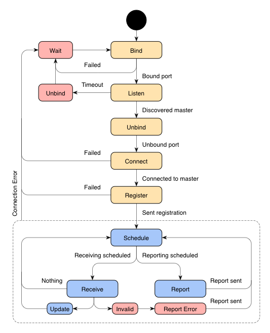

# Sensor Specification

A sensor is a process able to query its environment for data. This document
outlines the states, communications and messages a sensor is expected to conform
to in order to be part of a responsive rooms system.

## Sensor State Diagram



### Registration States (Yellow)

| State    | Description                                                       |
|:---------|:------------------------------------------------------------------|
| Bind     | Binds UDP port to use when listening for master broadcasts.       |
| Listen   | Listens for master discovery broadcasts (message M).              |
| Unbind   | Removes UDP port binding.                                         |
| Connect  | Connects to discovered master using TCP.                          |
| Register | Sends registration message to master (message SMR).               |

### Runtime States (Blue)

| State    | Description                                                       |
|:---------|:------------------------------------------------------------------|
| Schedule | Determines when to receive message and report state.              |
| Receive  | Attempts to receive (non-blocking) message from master.           |
| Update   | Updates local context data (using message CU).                    |
| Report   | Sends curent state to master (message SR).                        |

### Error States (Red)

| State    | Description                                                       |
|:---------|:------------------------------------------------------------------|
| Unbind   | Removes UDP port binding.                                         |
| Wait     | Waits for some suitable time.                                     |
| Invalid  | Received message that is invalid or of unknown type.              |
|Report Er.| Sends report to master about received invalid message (message E).|

## Sensor/Master Communication

A sensor may be connected to one, and only one, master process, which may query
its state.

### Registration

```
+------------+    +------------+
|   Sensor   |    |   Master   |
+------------+    +------------+
      |                 |
    +-+-+             +-+-+
    |   |<-----M------|   | Master Process Discovery (UDP Broadcast)
    |   |             |   |
    |   |-----SYN---->|   |
    |   |<--SYN/ACK---|   | TCP Handshake
    |   |-----ACK---->|   |
    |   |             |   |
    |   |-----SMR---->|   | Sensor Master Registration*
    +-+-+             +-+-+
      |                 |
      |                 |
```

\* If a sensor has any facility, room or location data, it will send it to
   master in order to help the master in determining its locality.

### Runtime

Runtime messages are not expected to be sent or received in any particular
order. The diagram below is to be considered an example.

```
+------------+    +------------+
|   Sensor   |    |   Master   |
+------------+    +------------+
      |                 |
    +-+-+             +-+-+
    |   |<-----CU-----|   | Context Update*
    |   |             |   |
    |   |------SR---->|   | Sensor Report**
    |   |             |   |
    |   |------E----->|   | Error Report
    +-+-+             +-+-+
      |                 |
      |                 |
```

\* The message is only sent if necessary, and typically only once.

\** Sensors report at sensible intervals to its master, but at least once every
29 seconds. A sensor failing to report for 30 seconds will be considered
`unresponsive` for another 30 seconds, after which it is forcibly deregistered
from its master. An `unresponsive` sensor succeeding to send a report to its
master before being deregistered regains normal status.

### De-registration

De-registration occurs by either party terminating the TCP session.

```
+------------+    +------------+
|   Sensor   |    |   Master   |
+------------+    +------------+
      |                 |
    +-+-+             +-+-+
    |   |<----FIN-----|   |
    |   |---FIN/ACK-->|   | TCP Finalization Handshake
    |   |<----ACK-----|   |
    +-+-+             +-+-+
      |                 |
      X                 X
```

## Sensor/Master Message Protocol

TODO
